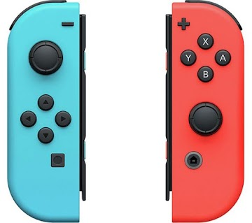
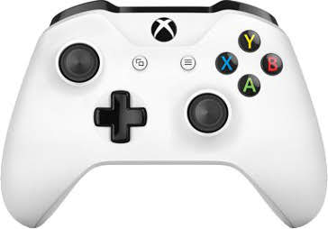

# 手柄说明

手柄控制需要特殊固件（测试版，有可能不稳定）

## 手柄键位

肩键 + ↑↓←→（ABXY）：切换模式

↑ ↓：改变作动器速度

← →：切换预设

射击键：触发

## 目前支持手柄

### Nintendo Switch JoyCon

只能同时连接一个，长按连接键不放，可观察到 4 个 led 灯闪烁，MYSR 机器插电，观察到 joycon 灯光常亮后即连接成功后即可放开按键

### Xbox Wireless (model 1708, 2 buttons)

长按连接键直至灯光快速闪烁后松开，然后给 MYSR 机器插电，插电后等待连接，直至 xbox 灯光常亮（xbox 手柄连接需要较长时间，请耐心等待）

