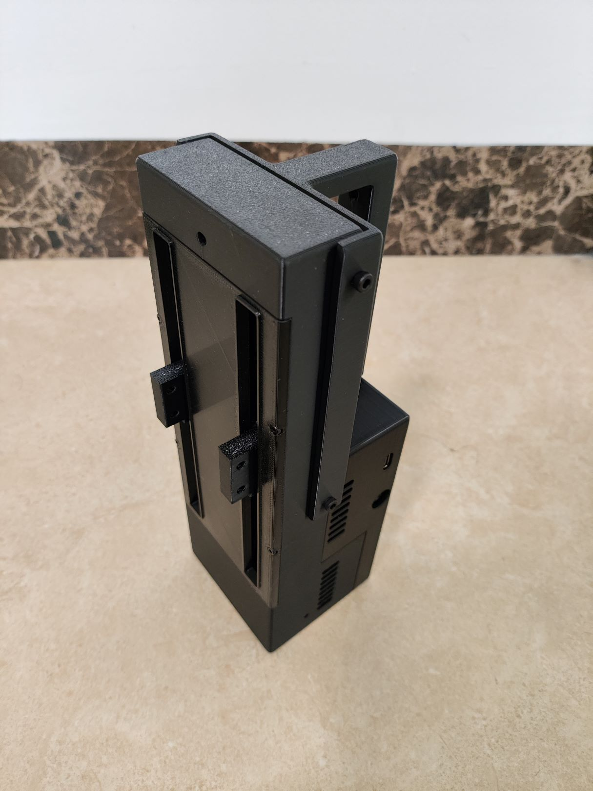

# 介绍

## 购买机器

[bilibili 摸鱼电玩](https://space.bilibili.com/3546781554051125)

## 介绍

随着各种 DIY 硬件的开源发展，各种各样的冲程玩具层出不穷，本项目受到 SSR1(Tempest MAx) 的启发而设计，在此感谢社区的活跃与交流。本机器规格长 23cm，高 8.5cm（包括挂架突起部分，未安装挂架），宽 9cm（包括手把突起部分）。

## 特性

### 高性能

本机器测试极限运行状态为 2kg 荷载，默认预设 1.3Hz 竖直往复连续运行 30 分钟(更高的加速度会导致滑齿)，测试后电机温度 60 摄氏度左右，平均功率 8w，用户在使用时请参照该例子使用，防止过多的热量堆积。机器配置了大电流堵转检测，可以预防电机烧毁。

### 长冲程

本机器目前设计最大运行范围是 11cm，范围可调。

### 无线控制

机器通过 wifi 信号连接路由器后，在同一网段内的手机可以连接机器进行操作。或者使用特殊固件可以通过 joycon 手柄进行控制

### 无线控制

机器通过 wifi 信号连接路由器后，在同一网段内的手机可以连接机器进行操作。或者使用特殊固件可以通过 joycon 手柄进行控制

### 可更新固件

在操作界面可以自行刷入固件，方便后期软件升级

### 安静

本机器使用无刷电机作为动力来源，使用同步皮带驱动冲程器，本机器主要的噪声来源是线轨滚珠的声音，相比舵机减速齿轮箱内部的巨大的高频噪声要安静的多

### 模块化

本机器设计使用模块化思路，方便维护和更换配件，后期可以设计不同方案的手把或者荷载挂架

### 可离线使用

传统玩具可能需要一些专门的播放器来播放数据，本机器可自定义预设曲线，无需外部数据也可以直接运行使用

### 兼容性高

本机器兼容 Tcode 命令，可以接收以往的 Tcode 播放器发出的指令运行

## 购买须知

① 本机器构件为 3D 打印，因此有 3D 打印不可避免的层纹瑕疵，但构建强度足够。
② 本机器虽然相比舵机噪音要舒适安静不少，但仍然是可观测到的噪音，同一房间的人可以明显听到异样（除非在极低的速度运行），因此不建议宿舍使用。
